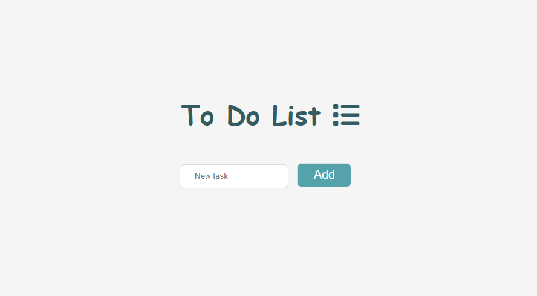
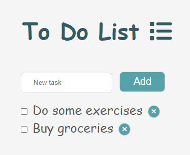

### To-do-list

This project represents simple to-do list which can create multiple tasks.

You can try live demo by clicking on 'github-pages' in Environment ->

When the button is clicked the task is added to the list together with checkbox and a delete button.

**For creating this project i used icon by Font Awesome and unicode for the cross on the Delete button.**

~Last update: 23.04.2023
